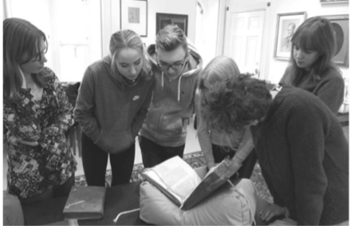

I have been actively engaged in teaching on medieval topics since 2014. I am currently a lecturer in English at Corpus Christi College, Oxford. My teaching covers English from the earliest written records through to the present day.  I teach Old English and Middle English to first and second year undergraduates, as well as one half of the Introduction to English Language and Literature introductory course.

Between 2018 and 2021, I taught at the University of Oslo. I contributed lectures and seminars to co-taught courses in Old English and Interdisciplinary Philology. I also created my own course on the [History of Early Medieval England](https://www.uio.no/studier/emner/hf/iakh/HIS2124/), which was cross-listed for both bachelor and master students.  I have also supervised and examined master's theses on a variety of subjects in both history and literature.

While completing my doctoral work at the University of Oxford, I served as Lecturer I in Old English at Magdalen College.  As part of this position, I taught lower and upper-level undergraduate courses on Old and early Middle English texts. During this time I was also made an Associate Fellow of the *Higher Education Academy* (HEA). I also taught for a shorter period at Jesus and Oriel Colleges and gave a lecture series of my own design on Literature and the Anglo-Saxon Church.

